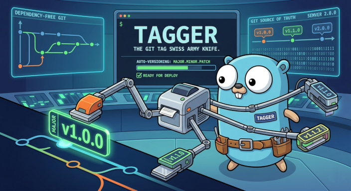

# Tagger: The Git Tag Swiss Army Knife

[](https://opensource.org/licenses/MIT)

. : Pragmatic Semantic Versioning for Git-based CI/CD : .




tagger is a CLI tool written in Go designed to automate Semantic Versioning (SemVer) based purely on Git Tags.

This project is in WIP state. Not ready for production yet.


### Motivation

In modern CI/CD ecosystems, managing artifact versions (Docker images, Binaries, Releases) has become unnecessarily bloated. Current solutions often rely on external states (Redis, databases), duplicated version files within the repo, or worse, extracting metadata from commit messages cluttered with emojis and redundant prefixes.

tagger is built on the premise that Git is the single source of truth. Tags are native, immutable markers; using them to manage versions is the cleanest and most deterministic way to orchestrate a GitOps pipeline.

### What Tagger Solves

- Zero External Dependencies: No need for external databases or .version files that trigger circular commits in your pipeline.

- Pragmatic Logs: Frees your commit history for its original purpose: documenting technical intent and solutions, not carrying infrastructure flags.

- SemVer Consistency: Ensures that version increments (Major, Minor, Patch) strictly follow the SemVer 2.0.0 specification.

- CI/CD Performance: As a static Go binary, tagger is ideal for lightweight runners, requiring no heavy runtimes (Python, Node, PHP).

### Engineering Principles

- Single Source of Truth: The current version is always the highest SemVer tag found in the Git history.

- Immutability: Once pushed to remote, a tag is the ultimate release authority.

- Zero Bloat: Focused on doing one thing — managing tags with maximum efficiency.

### Usage - Suggested GitOps Workflow

Tagger was designed to act as the transition trigger between your Continuous Integration (CI) and Continuous Delivery/Deployment (CD) processes. It ensures that Git remains the single source of truth, regardless of where your application is hosted (Kubernetes, AWS Lambda, Azure Web Apps, or Bare Metal servers).

Below is a suggested architecture dividing the lifecycle into three logical phases:

**Phase 1: Continuous Integration (App Repository)**
1. A developer opens a Pull Request (PR) with a new feature.
2. Code review is completed and the PR is approved.
3. Merging into the main branch triggers the primary CI pipeline.
4. The pipeline runs unit tests, linters, and security validations.
5. Once all tests pass, the pipeline executes **Tagger** (`tagger inc . -m`), generating a new annotated tag in the repository.

**Phase 2: Release & Packaging (Triggered by the new Tag)**
1. The creation of the new tag automatically triggers a secondary pipeline focused exclusively on the Release process.
2. This pipeline reads the newly created tag version (e.g., `v1.2.0`) and builds the **application artifact** bound to this version (this could be a Docker image, a compiled binary, a `.zip` file for AWS Lambda, etc.).
3. The versioned artifact is published to your target registry (Docker Hub, ACR, AWS S3, GitHub Releases, etc.).

**Phase 3: GitOps & State Update (Deploy Repository)**
1. The same Release pipeline clones a separate repository that holds your infrastructure and deployment configurations.
2. A script updates the application version within the configuration files (e.g., `terraform.tfvars`, `serverless.yml`, `ansible/group_vars`, or K8s manifests) to the new `v1.2.0` version.
3. The pipeline commits and pushes this change back to the infrastructure repository.
4. The Continuous Delivery engine monitoring this repository (ArgoCD, Flux) detects the state change and applies the new version to the target environment.

### Environment

It is possible to use tagger with SSH or HTTPS. 

#### SSH Usage

For SSH, the application will look for the PKI in your .ssh directory.


#### HTTPS Usage

For HTTPS remotes (like Azure DevOps, GitHub, or GitLab), tagger requires a Personal Access Token (PAT) injected via environment variables. Use this feature in your pipelines.

You must set the following variables before running the tool:
- `HTTP_USERNAME`: Your Git provider username.
- `HTTP_PAT`: Your Personal Access Token.

**Security & Scopes:** The provided PAT must have at least **Code (Read & Write)** permissions to successfully fetch existing tags and push new ones.


**Example:**

```bash
export HTTP_USERNAME="your-username-here"
export HTTP_PAT="your-token-here"

tagger list . --remote origin
Tags:
2026-03-30 20:03  v0.0.3
2026-03-29 00:50  v0.0.2
2026-03-28 12:26  v0.0.1
```

### Commands

#### Help

```bash
$ tagger help


	. : Git tag Swiss Army Knife : .

Usage:
  tagger [command]

Available Commands:
  completion  Generate the autocompletion script for the specified shell
  help        Help about any command
  inc         Create new tag incrementing version number.
  last        Return last tag in repository path.
  list        List all tags in repository path.
  version     Show version.

Flags:
  -d, --dry-run         Dry run
  -h, --help            help for tagger
  -r, --remote string   Remote name to use (default "origin")
  -V, --verbose         Verbose mode

Use "tagger [command] --help" for more information about a command.
```

#### List all tags

```bash
$ tagger help list
list [repository path] List all tags in repository path.

Usage:
  tagger list [repository path] [flags]

Flags:
  -h, --help   help for list

Global Flags:
  -d, --dry-run         Dry run
  -r, --remote string   Remote name to use (default "origin")
  -V, --verbose         Verbose mode

$ tagger list /path/to/repo
Tags:
2026-03-28 12:26  v0.0.1

$ tagger list /path/to/remote --remote repo2
Tags:
2026-03-30 20:24  v0.0.7
2026-03-30 20:22  v0.0.6
2026-03-30 20:07  v0.0.5
2026-03-30 20:03  v0.0.4
2026-03-30 20:03  v0.0.3
2026-03-29 00:50  v0.0.2
2026-03-28 12:26  v0.0.1
```

#### Increment Version (Major, Minor, or Patch)

tagger identifies the latest version, applies the logical increment, and optionally pushes to remote.

Note: Incrementing a higher version level resets lower ones (e.g., a Major bump on v2.1.35 results in v3.0.0).

```bash
inc [repository path] [flags] Create new tag incrementing version number.
	Tags must follow the pattern vM.m.p.
	Incrementing a higher version level resets lower ones (e.g., a Major bump on v2.1.35 results in v3.0.0).

Usage:
  tagger inc [repository path] [--dry-run|-d] [flags]

Flags:
  -a, --author string    Author for commit (default "Tagger")
  -e, --email string     Email for commit (default "tagger@bot")
  -h, --help             help for inc
  -M, --major            Increment major version
      --message string   Commit message (default "Version generated by tagger")
  -m, --minor            Increment minor version
  -p, --patch            Increment patch version

Global Flags:
  -d, --dry-run         Dry run
  -r, --remote string   Remote name to use (default "origin")
  -V, --verbose         Verbose mode

$ tagger inc -M . --dry-run --verbose
v0.0.1 -> v1.0.0
$ tagger inc -m . --dry-run --verbose
v0.0.1 -> v0.1.0
$ tagger inc -p . --dry-run --verbose
v0.0.1 -> v0.0.2
$ tagger inc -p . --dry-run
v0.0.2
```

#### Get last tag

```bash
last [repository path] Return last tag in repository path.

Usage:
  tagger last [repository path] [flags]

Flags:
  -f, --full   Full output - date and tag
  -h, --help   help for last

Global Flags:
  -d, --dry-run         Dry run
  -r, --remote string   Remote name to use (default "origin")
  -V, --verbose         Verbose mode

$ tagger last /path/to/repo
v0.0.7

$ tagger last /path/to/repo -f
2026-03-30 20:24  v0.0.7
```


## Building from sources

Building from source

1. Clone this repository: git clone https://github.com/dmontanari/tagger.git

2. Build the binary: make build

The binary will be in the root directory.


## Installation

Coming soon


## License

Distributed under MIT license. See LICENSE for more information.

© 2026 Daniel Montanari. All rights reserved.


